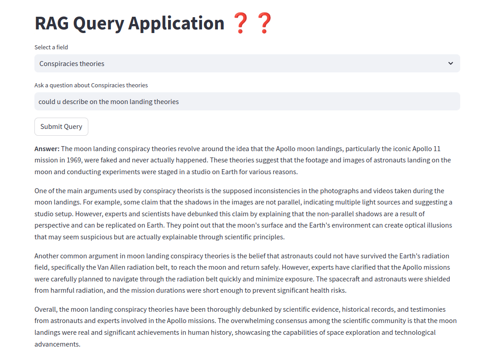

# 🚀 RAG Query Application ❓❓
This application allows users to ask questions about specific topics (fields) and get relevant answers. The application integrates several technologies for data storage, retrieval, and machine learning to process and respond to user queries.


## Authors

- [@suraj7743](https://github.com/suraj7743)


## Features

- ### Dropdown from Topics File #
    The application loads a list of topics from a local topics.json file. These topics are displayed in a dropdown menu for users to select from.

- ### Ask Questions Based on Selected Topic
    After selecting a topic, users can ask a question. The backend processes the query and fetches relevant information to generate a response.

- ### Add New Topics

    Users can add new topics (fields) via the UI. The new topics are saved locally in the topics.json file, updating the dropdown for future queries.
- ### Backend Query Handling
    The backend receives the selected topic and the user's question, processes the request, and returns a response by querying relevant data and providing the best match to the user.
    


## Architecture
### Frontend (Streamlit Application)

- User interface for selecting topics, entering queries, and adding new topics.
- Displays responses from the backend.
### Backend (Query Processing)

- Handles user queries by receiving selected topics and questions.
- Processes queries and generates responses, often using a Large Language Model (LLM).
### Data Storage (topics.json)

- Local JSON file that stores available topics for the dropdown.
- Supports read/write operations for updating topics dynamically.
### LLM Integration

- Utilizes a Large Language Model (like GPT) to generate contextually relevant answers based on user queries and selected topics.
### Workflow Summary
The frontend loads topics from topics.json.
Users select a topic and enter a question, which is sent to the backend.
The backend processes the request, potentially querying the LLM for an answer.
Responses are sent back to the frontend for display.


## Requirements
- **Python 3.12** Install Python 3.12 here.
- **Poetry**: Install Poetry by following the instructions here.

## Installation

### Clone the project

```bash
  git clone https://github.com/suraj7743/RAG_QUERY_APPLICATION.git
  cd RAG_QUERY_APPLICATION
  copy .env.sample to .env
```

### Go to the project directory

```bash
  cd 
```

### Install dependencies

```bash
  poetry install
```

#### Activate Poetry shell

```bash
  Poetry shell
```
#### Run FastApi Backend
```bash
  uvicorn main:app --reload
```
#### Run Frontend Streamlit app
```bash
  streamlit run app.py
```


## Configuration
**Port**: By default, the fast api service runs on **port** `8000` and streamlit app runs on `8501`


## Usage

Use the service , by navigating to the streamlit app running on given **port**

## How it could be benefited
**Customizable Knowledge Base**: Users can feed their own data, allowing for a personalized database that incorporates specific interests and information, enhancing the overall relevance of the content.

**Exploration of Unique Topics**: The application can feature unconventional subjects, such as conspiracies and undiscovered phenomena, broadening the scope of information available to users and catering to niche interests.

**High Query Efficiency:** The system enables efficient querying of vast amounts of information, making it easier for users to retrieve specific data quickly and effectively.

**Integration with LLMs**: By leveraging a language model (LLM), the project can generate insightful responses based on user queries, enhancing the interaction experience and providing sophisticated insights into the data.

## Screenshots


## Catch 
#### Ignore UI , I am not proficient in Frontend Part so used streamlit just to showcase my skills

## Improvement
- We could use VectoreStore database like qdrant or pinecone to store the chunks and retrive from them. 
- Could add field information in Mongodb and retrive from them. 
- Add Sockets to make chat like conversation and store chat in redis for fast retrival.
